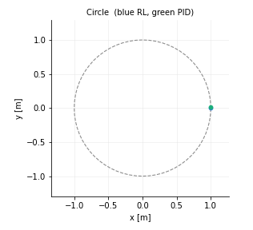
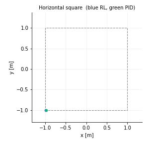
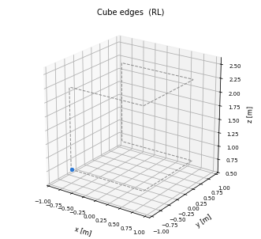
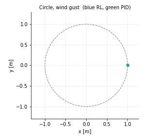

# Learned quadcopter path tracking in gym-pybullet-drones

This repository contains a reinforcement-learning controller for local path
tracking of a Crazyflie 2.x quadcopter in
[`gym-pybullet-drones`](https://github.com/utiasDSL/gym-pybullet-drones).
A PPO policy follows circular, square, and cubic waypoint paths. Its
performance is compared with the simulator's built-in cascaded PID controller,
`DSLPIDControl`.

A single network replaces the full PID cascade. It observes the vehicle state
together with the error to the active waypoint and outputs four motor commands.
Evaluation uses deterministic geometric references (square, triangle, circle,
vertical square, and cube edges) and reports RMS cross-track deviation. Two
mid-flight disturbances, a wind gust and a persistent single-rotor thrust loss,
are used to stress-test both controllers.

On the default circle the learned policy reaches 5–8 cm RMS while the PID
baseline remains at 5.0 cm. Motor commands are limited to ±25% of hover thrust.
Under a 17% rotor-loss fault the policy stays about 2.4 times closer to the
path than the PID controller does under a 7% loss. That robustness costs about
0.5 cm of precision in the healthy case.

This code was written for the TU Delft course AE4350, Bio-inspired Intelligence
and Learning for Aerospace Applications.

<p align="center">
  
  
</p>
<p align="center">
  
  
</p>

Blue is the learned controller. Green is PID.

## Install

```bash
git clone --recurse-submodules https://github.com/gulerburak/quadcopter-path-tracking-rl.git
cd quadcopter-path-tracking-rl

# if you already cloned without --recurse-submodules
git submodule update --init --recursive

conda create -n drones python=3.10 --override-channels -c conda-forge
conda activate drones

pip install --upgrade pip
pip install -e gym-pybullet-drones   # `sudo apt install build-essential` if pybullet fails to build
```

`requirements-freeze.txt` records the exact versions the reported results were produced
with. `pip install -r requirements-freeze.txt` reproduces that environment instead of
resolving fresh versions. The simulator is pinned to `gym-pybullet-drones` commit
`a8c238c`. The freeze pins CUDA-13 `torch`. On a CPU-only or different-CUDA machine,
install `torch` for your platform first, then run the command above.

## Evaluate

A trained checkpoint ships with the repository, so this works immediately after install.

```bash
# learned controller vs. PID on the same path, saves a 3D trajectory figure
python -m src.rl.evaluate_shapes --shape hsquare --controller rl,pid \
    --model models/capstone_s0/best_model.zip --rl_action_scale 0.15 \
    --size 2.0 --z 1.0

# vertical shapes use a smaller size, else the lower edge sits in the floor
python -m src.rl.evaluate_shapes --shape cube --controller rl \
    --model models/capstone_s0/best_model.zip --rl_action_scale 0.15 \
    --size 1.5 --z 1.5
```

Shapes are `hsquare`, `triangle`, `circle`, `vsquare`, `circle_v`, and `cube`.

Watch it fly, paced to wall clock.

```bash
python -m src.rl.evaluate_shapes --shape circle --controller rl \
    --model models/capstone_s0/best_model.zip --rl_action_scale 0.15 \
    --gui --realtime --speed 0.5
```

Disturbance tests.

```bash
# one-off horizontal gust at t = 4 s
python -m src.rl.evaluate_shapes --shape circle --controller rl,pid \
    --model models/capstone_s0/best_model.zip --rl_action_scale 0.15 \
    --disturbance wind --fault_time 4 --wind_impulse 1.5

# 30% thrust loss on rotor 0 from t = 4 s onward
python -m src.rl.evaluate_shapes --shape circle --controller rl,pid \
    --model models/capstone_s0/best_model.zip --rl_action_scale 0.15 \
    --disturbance rotor --fault_time 4 --fault_rotor 0 --fault_factor 0.7
```

`--rl_action_scale` must match the value the checkpoint was trained with (0.15 for the
shipped `capstone` model). It is the policy's control authority, not a runtime knob.

## Train

```bash
python -m src.rl.train --algo ppo --timesteps 4000000 --lr 1e-4 --target_kl 0.03 \
    --action_scale 0.15 --rotor_randomization 0.12 --crash_terminates \
    --init_randomization 1.0 --eval_init_randomization 0.0 \
    --stage_fractions 0.15,0.30,0.55 --stage_target_bounds_xy 2.0,4.0,6.0 \
    --stage_target_bounds_z 0.75:1.5,0.6:2.0,0.5:2.5 \
    --stage_episode_len_sec 6,10,16 --stage_num_segments 1,2,4 \
    --seed 0 --output_folder runs/capstone_s0
```

That is the `capstone` configuration. The three-stage curriculum is not optional. A flat
full-range target distribution never produces a learning gradient at all. `python -m
src.rl.train --help` documents every flag.

## Reproduce the experiments

```bash
PY=$(which python) bash tools/run_matrix.sh        # 5 configs x 3 seeds, then shape eval
PY=$(which python) bash tools/run_robustness.sh    # rotor-loss sweep + wind gust, 3 seeds
PY=$(which python) bash tools/run_sensitivity.sh   # learning/reward parameter sweep
```

All three resume. Rerunning skips work already recorded in the output CSVs. They write to
`results_matrix/` and `results_sensitivity/`, and honour `ROOT`, `PY`, `OUT`, `SEEDS` and
`TIMESTEPS` from the environment. Expect hours per run on a single GPU laptop.

The committed summary CSVs are the ones the paper's numbers come from, so the table and
figure builders run without retraining anything.

```bash
python tools/build_report_tables.py     # nominal tracking tables + deviation bars
python tools/build_robustness.py        # rotor/wind tables + control-authority Pareto
python tools/build_sensitivity.py       # learning-parameter sensitivity figure
python tools/build_learning_curves.py   # per-stage learning curves
```

Figures land in `report/figures/`. Set `FIGDIR` to redirect them.

## Layout

```
src/rl/waypoint_aviary.py   training environment (subclasses upstream BaseRLAviary)
                            per-episode random target, error-coordinate observation,
                            optional multi-segment paths, domain randomization
src/rl/train.py             PPO/SAC training with the N-stage curriculum
src/rl/evaluate_shapes.py   the results harness (deterministic shapes, cross-track
                            deviation, disturbances, GUI supervision, figures)
src/rl/evaluate.py          quick eval on the training task (one static target)
src/rl/evaluate_path.py     eval on a random multi-segment path
src/rl/shape_paths.py       geometric reference paths
src/rl/path_utils.py        arc-length path densification
src/envs/CtrlAviary.py      deployment env (upstream CtrlAviary plus the path-following
                            controller harness that drives RL and PID identically)
src/controllers/RLControl.py  a trained checkpoint behind upstream's BaseControl API
tools/                      experiment drivers and table/figure builders
```

## Licence

MIT. See `LICENSE`.
